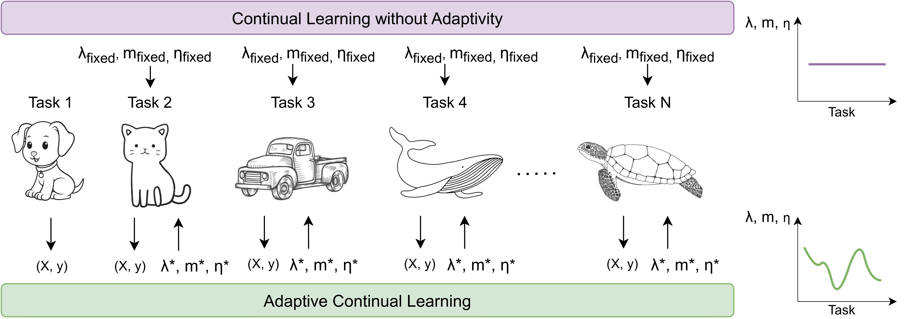

# AdaCL: Adaptive Continual Learning



## Introduction

Class-Incremental Learning aims to update a deep classifier to learn new categories while maintaining or improving its accuracy on previously observed classes. Common methods to prevent forgetting previously learned classes include regularizing the neural network updates and storing exemplars in memory, which come with hyperparameters such as the learning rate, regularization strength, or the number of exemplars. However, these hyperparameters are usually tuned at the start and then kept fixed throughout the learning sessions, ignoring the fact that newly encountered tasks may have varying levels of difficulty. This study investigates the necessity of hyperparameter ‘adaptivity’ in Class- Incremental Learning: the ability to dynamically adjust hyperparameters such as the learning rate, regularization strength, and memory size according to the properties of the new task at hand. We propose AdaCL, a Bayesian Optimization based approach to automatically and efficiently determine the optimal values for those parameters with each learning task.
We built upon the [PYCIL library](https://github.com/G-U-N/PyCIL) library. We use [Optuna](https://github.com/optuna/optuna) for the hyperparameter selection. We thank the repos for providing helpful components.

## Dependencies
1. [Optuna](https://github.com/optuna/optuna)

For the PYCIL:

2. [torch 1.81](https://github.com/pytorch/pytorch)
3. [torchvision 0.6.0](https://github.com/pytorch/vision)
4. [tqdm](https://github.com/tqdm/tqdm)
5. [numpy](https://github.com/numpy/numpy)
6. [scipy](https://github.com/scipy/scipy)
7. [quadprog](https://github.com/quadprog/quadprog)
8. [POT](https://github.com/PythonOT/POT)

## Datasets
When utilizing CIFAR100 for training, the framework will handle the downloading process automatically. However, if you're training on imagenet100, you need to specify the dataset folder in utils/data.py. For further detail please refer to PYCIL library.

## Run Experiment

1. Edit the `[MODEL NAME].json` file for global settings like `init_cls`, `increment`, `convnet`, `seed`.
2. Additional parameters related to model optimization, such as batch size, optimization epoch, learning rate decay, weight decay, milestone, and temperature, can be adjusted within the corresponding Python file.
3. You can edit the hpo related parts such as sampler, n_startup_trials, pruner, and n_trials in the `trainer_ada.py` file.
   
4. Then run for adaptive version:
   ```bash
   python main_ada.py --config=./exps/[MODEL NAME].json
5. To run fixed version:
    ```bash
   python main.py --config=./exps/[MODEL NAME].json
